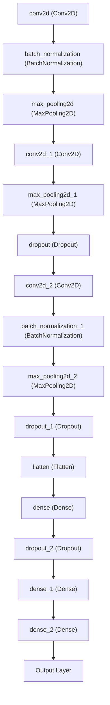

# Implementation

## Overview

This document outlines the implementation of a neural network model designed to recognize dance styles from music. The approach utilizes a convolutional neural network (CNN), leveraging spectrograms of songs to train the model efficiently in identifying specific dance styles. Drawing inspiration from existing music genre recognition projects, this model adapts similar methodologies to analyze dance-related audio patterns.

## References

For foundational concepts and methodologies, the project referenced the following works on music genre recognition:
- Thomas-Bouvier. "Musical genre recognition using a CNN," GitHub repository. [GitHub - thomas-bouvier/music-genre-recognition](https://github.com/thomas-bouvier/music-genre-recognition)
- Priya-Dwivedi. "Music Genre Classification," GitHub repository. [GitHub - priya-dwivedi/Music_Genre_Classification](https://github.com/priya-dwivedi/Music_Genre_Classification)

Also more sources can be found in [Sources.md](Sources.md).

## Project Structure

The project is organized into two main components:
- **`own_model`**: A custom-built neural network developed without the use of standard neural network libraries.
- **`peer_model`**: Utilizes TensorFlow and Keras to benchmark against the `own_model`.
- **`preprocess_data.py`**: A script responsible for loading music files and converting them into spectrograms, preparing them for model ingestion.

## Preprocessing

Detailed preprocessing steps and methodologies are further elaborated in [Preprocessing Documentation](Preprocessing.md).

## Peer Model Description

The peer model is built using TensorFlow and Keras, featuring a convolutional neural network architecture with the following layers and components:

### Training Protocol

The peer model is trained on three distinct dance styles, with 33 songs per style over 25 epochs, demonstrating significant learning and adaptability to different audio characteristics.

### Optimization

The model is optimized using the Adam optimizer, categorical cross-entropy loss function, and a learning rate of 0.001. The model is compiled with a batch size of 32 and a validation split of 0.2. It also uses L2 regularization to prevent overfitting.

## Custom Model Implementation

Details on the custom model's architecture and implementation are available in [Own Model Documentation](OwnModel.md).

## Results and Analysis

The models were trained with 3 dance styles: Salsa, Fusku, and Waltz.

- **Peer Model**: Achieved a recognition accuracy of 80%, trained over 25 epochs within 30 minutes.
- **Own Model**: Attained a 50% accuracy rate, demonstrating slower learning with a training duration of 8 hours over 10 epochs.

The comparison between the models highlights the effectiveness of using established neural network libraries and optimized model architectures in achieving higher accuracy and efficiency in dance style recognition from music.

## Use of Large Language Models

LLM:s were used to develop ideas, optimize the implementation, debuging and writing documentation and comments. Also tests were generated with the help of LLM:s. LLm:s helped to understand the concepts and to develop the project further. But it also included problems like generating broken code or useless tests. 