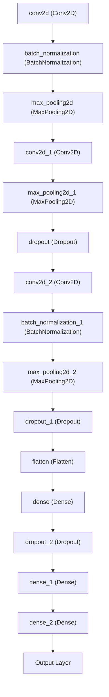

# Implementation

## Idea

The idea was to creata neural network modal that cans to recognice dance style from music. This would be achived by training convolutional neural network to recognize the dance style from the music. The songs would be converted to spectrograms and the network would be trained to recognize the dance style from the spectrogram. The motivation for using convolutional neural network was that it is good at recognizing patterns from images and spectrogram is a image that represents the music in a way that is easy to analyze. I used music genre recognition as a reference for the project. 

References for music genre recognition:
- Thomas-Bouvier, “GitHub - thomas-bouvier/music-genre-recognition: Musical genre recognition using a CNN,” GitHub. https://github.com/thomas-bouvier/music-genre-recognition
- Priya-Dwivedi, “GitHub - priya-dwivedi/Music_Genre_Classification,” GitHub. https://github.com/priya-dwivedi/Music_Genre_Classification

## Structure

The project is divided to `own_model` and `peer_model`. The `peer_model` is used to compare the implementation of `own_model `which is the own implementation of neural network without using any neural network libary. There is also `preprocess_data.py` that is used to load and convert the song to spectograms.

## Preprocessing

[Preprocessing documentation](Preprocessing.md)

## Peer model 

Peer model uses Tensorflow and Keras.
The model is a convolutional neural network that has 3 convolutional layers and 3 dense layers. It also uses batch normalization, max pooling and dropout layers.

 ### Training

 The model is trained with 3 dance styles and and 33 songs from each style. The model is trained with 10 epochs.

## Own model

The own model is documentend in [Own model documentation](OwnModel.md)

